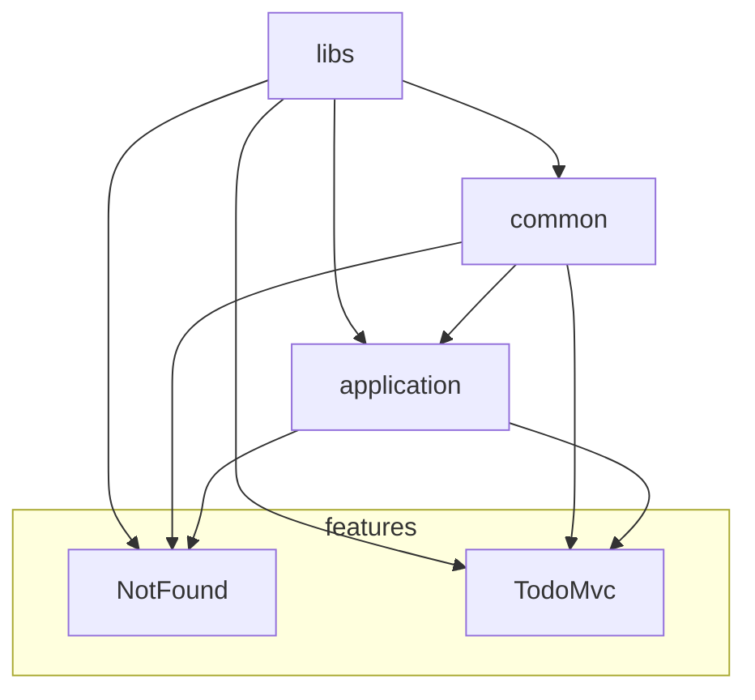

- `libs`: ドメインロジックを持たない。どこからでも使える。
- `common`: ドメインロジックを持つ。application, features から使える。
- `application`: 外部との接点、ならびにルーティングを受け持つ。外部には Web API, ブラウザ (Cookie, LocalStorage) などが含まれる。
- `features`: 各機能を担当する。

